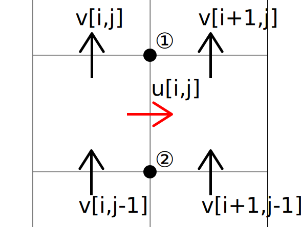

# CFD 移流・拡散項

## 移流
移流項は流体が流れに沿って移動する様子を示す項(？)です。この項は

\[ \nabla \cdot (\varepsilon \rho \bm{u}_f\bm{u}_f)\]

と書かれます。

### 移流項の導出
移流項の導出自体は他にも多くの文献があるので後回しとして、「普通のN-S方程式では移流項は\( (\bm{v}\cdot\nabla ) \bm{v}\)じゃないか、同じなのか」というところを確認します。
\( (\bm{v}\cdot\nabla ) \bm{v}\)は書き下すと

\[ (\bm{v}\cdot\nabla ) \bm{v}=
  \left(
  \left( \begin{array}{c} u \\ v \\ w \end{array} \right)
  \cdot
  \left( \begin{array}{c} \frac{\partial}{\partial x} \\ \frac{\partial}{\partial y} \\ \frac{\partial}{\partial z} \end{array} \right)
  \right)
  \left( \begin{array}{c} u \\ v \\ w \end{array} \right)
  =\left(  u\frac{\partial}{\partial x} + v\frac{\partial}{\partial y} + w\frac{\partial}{\partial z}  \right)
  \left( \begin{array}{c} u \\ v \\ w \end{array} \right)
\]

となります。従って、x成分は

\[u\frac{\partial u}{\partial x} + v\frac{\partial u}{\partial y} + w\frac{\partial u}{\partial z} \]

です。これだとまだわかりませんが、ここで連続の式を導入します。連続の式は

\[\frac{\partial u}{\partial x} + \frac{\partial v}{\partial y} + \frac{\partial w}{\partial z} =0\]

ですので、これの両辺に\(u\)をかけて先程の式に足します(0なので足してもよい)。すると

\[u\frac{\partial u}{\partial x} + u\frac{\partial u}{\partial x}
+ v\frac{\partial u}{\partial y} + u\frac{\partial v}{\partial y} 
+ w\frac{\partial u}{\partial z} + u\frac{\partial w}{\partial z} 
  = \frac{\partial uu}{\partial x} + \frac{\partial uv}{\partial y} + \frac{\partial uw}{\partial z}
  = \frac{\partial u \bm{u_j}} {\partial x_j}\]

となります(最後のはアインシュタインの縮約表記です)。従って、3次元では

\[\frac{\partial \bm{u_i} \bm{u_j}} {\partial x_j}=\nabla \cdot (\bm{u}_f\bm{u}_f)\]

となります(最後は書き方の問題です…)。とりあえず注意すべきなのは、連続の式を用いないとこの2つの式は同値にならないということです。では局所体積平均法では連続の式の右辺が0でないが大丈夫なのか？これは今後検証したいところです(TODO)。

### 移流項の計算

#### 空間差分スキーム

移流項および拡散項の計算において注意すべきなのは、速度が速度方向の格子側面に定義され、空隙率や密度がセル中心に定義されていることです。特にu,v,wが別の場所に定義されていることが問題で、「uの点での移流項を求めるためにこの点でのvの値が必要だ」という時、明示的にはその値が与えられていないのです。
これについて以下の図で説明します。

(i,jはコード内の表記を使用しています。)この図において、u[i,j]での移流項を求める際に出てくる

\[ \frac{\partial v}{\partial x}\]

を求めるには、①および②でのvの値、つまり\(v[i+1/2,j]およびv[i+1/2,j-1]\)が必要なことが分かるでしょうか？
よって、この①、②を求める空間差分スキームが必要になってきます。本コードではこの空間差分に二次中心差分と一次風上差分のハイブリットスキームを使用しています。これはSpalding (1970)によって提案されたもの(らしい)で、精度はいいが安定性が低い二次中心差分と精度は低いが安定的である風上差分を組み合わせた手法になっています。具体的にはペクレ数

\[ Pe= \frac{u  \rho}{ \nu}\Delta x \]

とよばれる拡散と移流の影響比を示す数を用い、

\[v[i+1/2,j]= \begin{cases}
v[i,j]] &(Pe>1.5)\\
0.5(v[i+1,j]+v[i,j]) &(1.5>Pe>-1.5)\\
u[i+1,j] &(Pe<-1.5)\\
\end{cases} \]

として計算します。以下では、このように定義されていない点での値はこのスキームを用いて計算した値であると思ってください。先ほどの図の表記を用いていますので、整数でない点が定義されていない点です。

#### アルゴリズム
移流項の計算は比較的直感に近い形で行われています。ここではu成分の移流項について述べますが、v,w方向も同様です。
定義式は先程の導出において用いた

\[\frac{\partial uu}{\partial x} + \frac{\partial uv}{\partial y} + \frac{\partial uw}{\partial z}\]

から出発します。局所体積平均を用いているので、密度および空隙率が入り、

\[\frac{\partial \varepsilon uu}{\partial x} + \frac{\partial\varepsilon uv}{\partial y} + \frac{\partial\varepsilon uw}{\partial z}\]

を計算します。(TODO)

## 拡散項(粘性項)
拡散項は粘性項とも呼ばれる、粘性に関連する項になっています。この項はよく用いるナビエ・ストークス方程式では\(\nabla \cdot(\varepsilon \bm{\tau})\)と表されます。

### 拡散項の導出
これだけ書くと非常に簡単そうに見えますが、実際には複雑な構造をしています。というのも、せん断応力\(\bm{\tau}\)がテンソル(3x3の行列)だからです。粘性に関するこの項については[別のページ](algorithm_CFD_advecdiff_deriviation_diff.md)で述べます。

### 拡散項の計算
ソルバー内では\(\bm{\tau}\)を明示的に計算しているわけではなく、直接\(\nabla \cdot(\varepsilon \bm{\tau})\)を計算しています。これによってコードは更に複雑にはなっているのですが、効率的な計算が可能になっているのだろうと思われます。(TODO)
