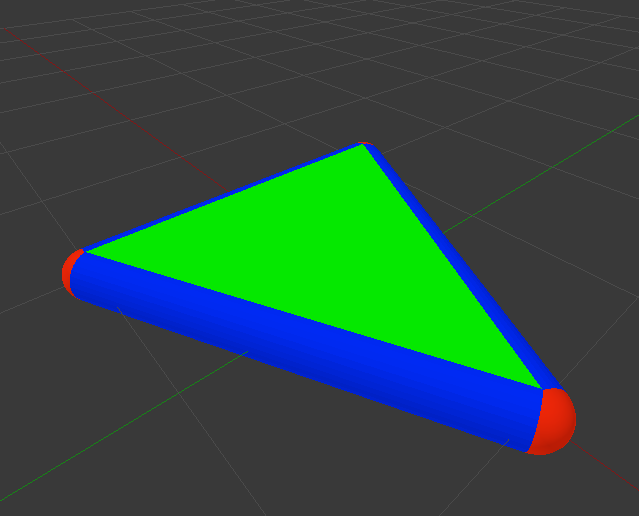
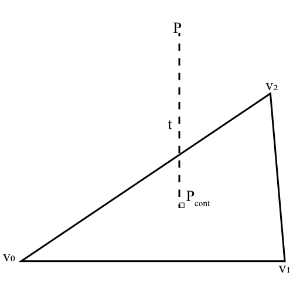
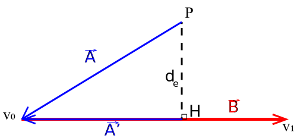
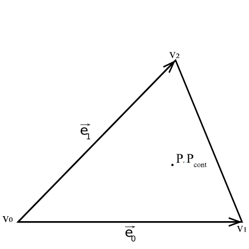
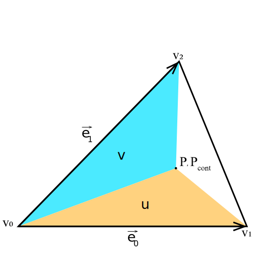
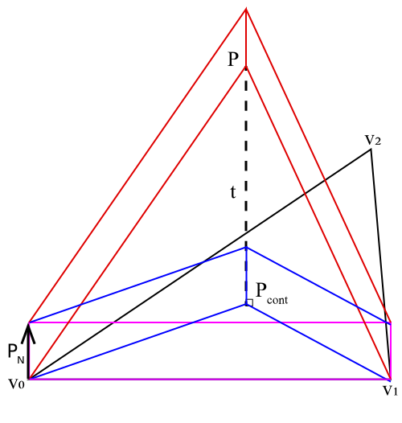
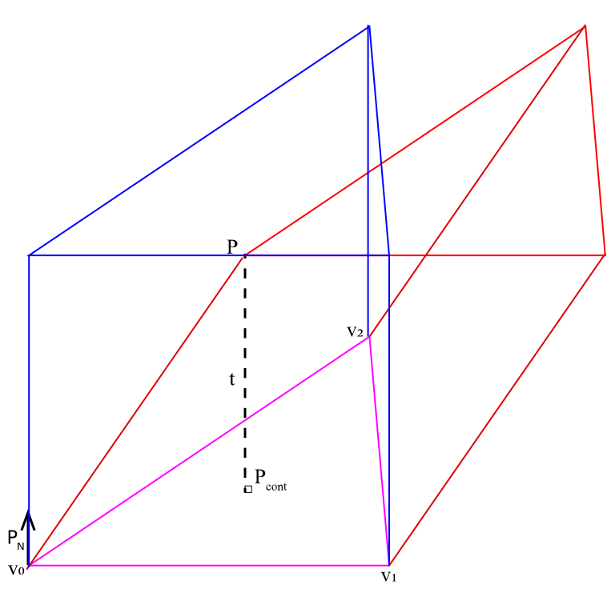

# DEM-SDF

## SDFによる壁面モデリング
粒子と壁面の衝突力を求めるには通常、メッシュと粒子の衝突判定を繰り返す手法が取られます。しかしこれを各ステップで計算していると非常に時間がかかりますので、本ソルバーでは符号付き距離関数(SDF)を用いた壁面力計算が導入されています。SDFとは、壁面との距離に壁面の内外で符号をつけた関数になります。

\[ \phi(\bm{x}) = s(\bm{x}) \cdot d(\bm{x})\]

ここで、\(\phi,s,d\)は、それぞれ、符号付き距離関数、符号、距離です。符号付き距離関数はスカラーの連続場ですが、コード上で連続場は用いることができないので、構造格子状に符号付き距離関数を計算・保持し、必要に応じて補完を行います。符号付き距離関数の計算は「SDFの算出」、補完については「SDFの呼び出し」で説明します。

このSDFを用いて、点\(\bm{x}\)に最も近い壁面の法線方向は

\[ \bm{N}(\bm{x}) = \frac{\nabla\phi(\bm{x})}{|\nabla\phi(\bm{x})|}\]

で計算されます。\(|\nabla\phi(\bm{x})|\)は連続場であれば1ですが、離散化しているために1にならず、これを補正するために分母が必要となっています。

また、最も近い壁面との距離は\((\phi-r)\)ですので(\(r\)は粒子の半径)、壁面との接触ベクトルは
\[ \bm{\delta(\bm{x})} = (\phi-r)\bm{N}\]

となります。これを用いて、通常のDEMと同様に計算を行うことで、壁面力を計算します。

しかし、[Shigeto,2013](https://doi.org/10.1016/j.cej.2013.07.073)より、SDFの離散化によりこのままではエネルギーの保存性が乏しいという問題が指摘されています。そこで接触力計算をポテンシャルの勾配によって導くことでエネルギーの保存性を高めます。

壁面-粒子間の弾性ポテンシャルは

\[P=\frac{1}{2}k|\delta|^2=\frac{1}{2}k(\phi-r)^2\]

なので、この勾配より、壁面力は

\[F=\nabla P=k(\phi-r)\nabla\phi=k\bm{\delta}|\nabla \phi|\]

で計算されます。（2つ目の式変形は\(\phi\)が距離の関数なので\(\nabla \phi\)がくっついてきます。）すなわち、通常のDEMの接触力に\(|\nabla \phi|\)がかけられたものになります。(これがコード上で言う```pPotentialScale```です。)

これを用いて壁面力の計算を行います。

## SDFの算出
では、SDFはどのように計算されているでしょうか？各セルに対して壁面からの距離を計算する…とは言いますが、考えてみるとその計算は簡単ではないということが分かります。

SDFは各壁面からの距離のうち最小のものです。よって、各壁面を三角形平面に分割し、その1つ1つからの距離を算出、その後距離のうち最小のものをSDFとして保持すれば良いことになります。これがSDF構築アルゴリズムの最も外側の考え方になります。

とはいえ、すべての三角形平面とすべてのサンプリング点を計算するのは非常に時間がかかりますし、無駄が多いです。なぜなら、ほとんどの点は三角形平面と非常に遠いところにあるため、SDFの幅(Rangeと呼ぶ)より遠く、計算する必要がないためです。そのため、計算前に「計算すべき候補の部分」を粗く選んでおき、その中で実際にRangeより距離が小さいかを確認する手段が用いられます。この計算効率化のための部分処理はCG分野でよく行われるバウンディングボックスと呼ばれる手法とよく似ています。すなわち、三角形ポリゴンの持つx,y,zの幅に対し、それぞれの方向にRangeだけ広がった立方体を「計算すべき候補の部分」とします[^1]。

[^1]:ここで、「壁面の方向に沿った直方体の方が候補が少ないのでは？」という指摘ももちろん考えられます。しかし、そのような直方体を考える場合、SDFの各セルへのアクセスが非常に煩雑になります。「このセルが直方体に入っているか？」を確認する場合分けに計算コストがかかるため、厳密でなくともx,y,z方向にfor文を回せる立方体のほうが効率が良いのだと思われます。CG分野ではこの軸に沿った立方体をAABB(Axis-Aligned Bounding Box)、壁面に沿った直方体をOBB(Oriented Bounding Box)と呼びます。どちらも衝突判定に使用されますが、最も一般的なのはAABBの方のようです。


さて、ではこの候補の点群に対して、SDFはどのように計算されているでしょうか？まず、天下り的ではありますが、三角平面でのSDFの分布を見てみましょう。



上の図では説明のために色を付けていますが、SDFの等値面はこのようになることが分かるでしょうか？ここに示したように、SDFの計算においては「面からの距離」のみならず、「辺からの距離」「点からの距離」も求め、そのなかから最小の距離を選ばなければならないことが分かります。従って、以下ではこれらそれぞれからの距離の算出方法を見ていきます。

以下では、下図に示した文字を用いて説明を行います。与えられる値は\(\bm{P,v_0,v_1,v_2}\)です。



### 点からの距離(球状)
点からの距離は、つまり2点間の距離ですので、非常に簡単です。\(\bm{P}\)と\(\bm{v_0}\)の距離\(d_v\)は

\[ d_v= ||\bm{v_0-P}||\]

で求められます。(もちろんコード上ではノルムの計算のために各成分の二乗和を求めています)

しかし求めるのは符号付きの距離関数ですので、符号を調べなければなりません。本ソルバーでは各点が法線方向を保持している[^2]ので、内積を用いて符号を計算できます。つまり、法線ベクトル\(\bm{N_v}\)と先ほどの二点間ベクトルの内積

\[ \left(\bm{v_0-P}\right)\cdot \bm{N_v}\]

は２つのベクトルがなす角の\(\cos\theta\)と符号が同一ですので、同じ方向であれば正、逆方向であれば負の値を示します。これを用いて符号をつけ、最終的にSDFは

\[SDF_{vertex}=-\rm{sgn}{\left[\left(\bm{v_0-P}\right)\cdot \bm{N_v}\right]}||\bm{P-v_0}||\]

で計算できます(マイナスがつくのは二点間ベクトルが\(\bm{v_0}\)から伸びているため。どこかの時点で逆転させればよいですが、コード上の実装に合わせた記述にしました。)。

[^2]:「点の法線方向？点がいくつもの面を持っていたらどうするの？」という疑問もあるかと思いますが、実はここでは各点がメッシュに属しているので、面の法線方向を持っていることになり、問題ありません。つまり共有されている点は各メッシュに重複して存在しています(ただし法線方向は別のものを持っている)。これは特に日本語で難しい点なのですが、英語では共有されている点は「vertice」と表され、今回のように各メッシュが持つ点は「vertex」と表されます。ここで用いられているのは「vetrice」であり、コード上でもその名前が使用されています。

### 辺からの距離 (円柱状)



辺への距離は正射影ベクトルを用いれば算出できます。まず、\(\bm{A}\)の\(\bm{B}\)への正射影ベクトルは

\[ \bm{A'} = \frac{\bm{A\cdot B}}{||\bm{B}||^2}\bm{A}\]

ですので、\(\bm{B}\)に対する\(\bm{A'}\)の符号付きの長さ比\(t\)は

\[ t = -\frac{\bm{A\cdot B}}{||\bm{B}||^2}\]

です(マイナスがついているのは\(\bm{B}\)と方向を合わせるため)。点とこの辺が距離を持つのは上の図で示した円柱上にPがある場合なので、条件として

\[ 0<t<1.0 \]

が必要です。このとき、辺と点\(\bm{P}\)の距離は

\[ d_e = ||\bm{A}-\bm{A'}||=||\bm{A}+t\bm{B}||\]

です。符号判定は点の時と同様に辺の法線方向\(\bm{N_e}\)を用いて

\[ -\rm{sgn}[\left(\bm{A}+t\bm{B}\right)\cdot \bm{N_e}]\]

とします。

### 面との距離
面との距離計算(そして面上にある判定)は上述の2つに比較して大変です。まず、面上の判定から考えてみましょう。面に対して垂直な方向から見た図を考えます。



\(\bm{P}\)と\(\bm{P_{cont}}\)は面から見ると鉛直方向なので重なります。さて、ここでは面と点の距離が(点や辺との距離にならずに)発生する条件を考えます。すると、面を垂直方向に伸ばした三角柱の内部に点が存在することが条件であることが分かります。よって、上の図において点\(\bm{P}\)が三角形の内部に存在することが面との距離が発生する条件(以下、面上条件と呼びます)となります。

この条件はどのように計算すればよいでしょうか？いくつかの手法が存在しますが、本ソルバーでは面積を求める手法を用います。三角形の面積を\(det\)とし、下図に示すような符号付面積\(u,v\)を求めます。



\(u,v\)はそれぞれ、\(\bm{e_1}\),\(\bm{e_1}\)より三角形側の場合に正、逆側の場合負になる符号付面積とします(これは後述するように外積計算から自然に求まる符号です)。このとき、面上条件は

\[0<u,0<v, u+v<det \]

の三条件で表されます。

では実際に距離と面上条件を求めます。まず法線方向の単位ベクトル\(\bm{P_N}\)を求めます。

\[\bm{P_N}=\frac{\bm{e_0}\times\bm{e_1}}{||\bm{e_0}\times\bm{e_1}||}\]

三角形の面積\(det\)は三重積を用いて求められます。

\[det=\left|\frac{\bm{e_0}\cdot\left(\bm{P_N \times e_1}\right)}{2}\right|\]

（\(det\)という名前なのは三重積が行列式によっても求められるからだと思われます。）三重積は3つのベクトルで張られる平行六面体の符号付体積を示すので、(高さ1の六面体の体積)/2=高さ1の三角柱の体積=三角形の面積となることから計算ができます。


では\(u,v\)はどのように求められるでしょうか？本ソルバーでは以下のように求められます。

\[u=\frac{-(\bm{P-v_0})\cdot\left(\bm{P_N \times e_1}\right)}{2}\]
\[v=\frac{\bm{P_N}\cdot\left(\bm{-(P-v_0) \times e_0}\right)}{2}\]

ここでは三角形内部で符号付き体積が正になるようにマイナスの符号がついています。これは\(\bm{e_0}\)と\(\bm{e_1}\)の順番(どちらを\(\bm{e_0}\)とするか)によって正負が変わります。この図のように\(\bm{e_1}\times\bm{e_0}\)の方向と点Pの方向が逆の場合には負がつきます。

たとえば\(v\)は、下図に示す赤色の部分の体積を示しています。この体積は青色の体積と等しいため、結局三角形の面積を与えます。


この\(u,v\)を用いて、上述の面上条件を満たすか確認します。その上で面上に点が存在する場合、以下のように距離を求めます。

\[t=\frac{\bm{e_0}\cdot\left(\bm{-(P-v_0) \times e_1}\right)}{2}\frac{1}{det}\]

この第一項は下図の赤色の三角柱の体積を示しますので、青色の体積と等しいです。よって高さ1の三角柱の体積だった\(det\)との比が高さ\(t\)になる、ということです。点が面の逆側にある場合には距離が負になりますが、符号付き距離を求めるのでこのままで問題ありません。



以上により距離と面上判定が行えました。[^4][^3]

[^3]:さて、ここまでこのようにコード上の議論を正当化しましたが、この説明が本当に作者の意図したものなのかはわかりません…どうも遠回りしているような気もします。もともとはメッシュと粒子の距離を求めるために用いられたルーチンを使用しているようですが、もっと以前にはレイトレーシング法におけるメッシュとレイの交差判定に用いられていたのかもしれません(rayとの交差についてのコメントがある)。より分かりやすい議論がありましたらぜひ教えてください。

[^4]:体積を求める際、1/2をかけて三角柱の体積としましたが、実際のコード上では必要なのは比なので、\(det,u,v,t\)の体積算出で1/2が取り除いてあります。

### Re-Filling
最後に、値が設定されていない点をRangeの最大・最小値で埋める作業が必要です。これはSDFでは不要な操作ですが、IBMの生成にSDFを使用することから、すべての点をSDFの値で埋める必要があります。「Re-」というのは再帰的に、という意味なのではないかと推測されます。

このアルゴリズムは簡単で、すべての点に対して「周囲の点が埋まっていたらその点と同じ値で埋める」を繰り返すというものです。この手法では周囲の点が正負逆の値を持っている場合に想定されない動作をすることが予想されますが、メッシュが閉曲面をなしていればそのようなことは起こりえないので大丈夫としているのだと思います。このアルゴリズムは再帰が多くて遅いのではという疑問もありますが、計算はシミュレーション前の1度だけなので、ボトルネックにはならないということなのだと思います。このアルゴリズムはFlood Fillingと呼ばれ、高速化手法も提案されています(26-way 3D scanline flood fillingなど？)ので、もし必要ならこのような手法を実装するのもありだと思います。

## SDFの呼び出し
SDFの呼び出しは、単に三次元配列に格納されているSDFにアクセスするだけですが、格子点に粒子がいるとは限らないため、その後の補完を行っています。


上の図のような状況を考えます。点Pの値を求めるため、\(\phi_1\)から\(\phi_8\)を用いて補完します。この手法はTrilinear interpolation(三重線形補完？)と呼ばれる手法です。\(\alpha,\beta,\gamma\)は辺の長さに対する比率を示しています。
Trilinear interpolationでは最終的な値を1式で求められますが、今回はPにおける勾配も求めるので、\(x^-\)などを逐次求めていく手法を用います。

たとえば\(x^-\)は下式のように補完して計算されます。

\[x^-=(1-\beta)(1-\gamma)\phi_{000}+(1-\beta)\gamma\phi_{001}+\beta(1-\gamma)\phi_{010}+\beta\gamma\phi_{011}\]

点Pの値は

\[P=(1-\alpha)x^-+\alpha x^+\]

です。勾配は

\[(\nabla \phi)_{P}=\left(
    \begin{array}{c}
      x^+-x^- \\
      y^+-y^- \\
      z^+-z^- \\
    \end{array}
  \right)/\Delta_{cell}\]

  と求められます。
